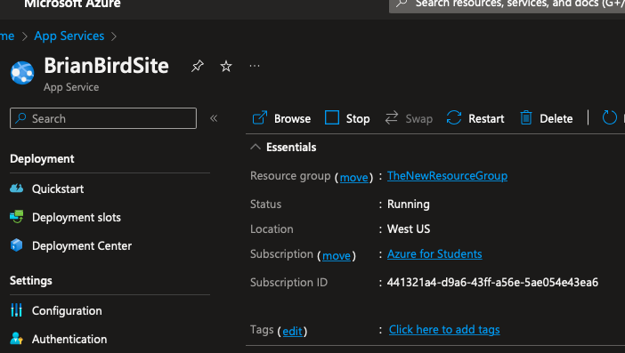
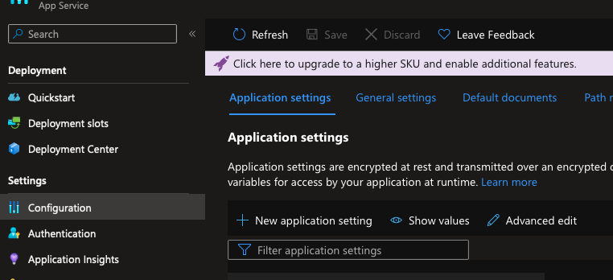
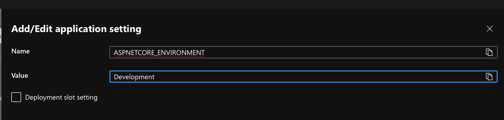
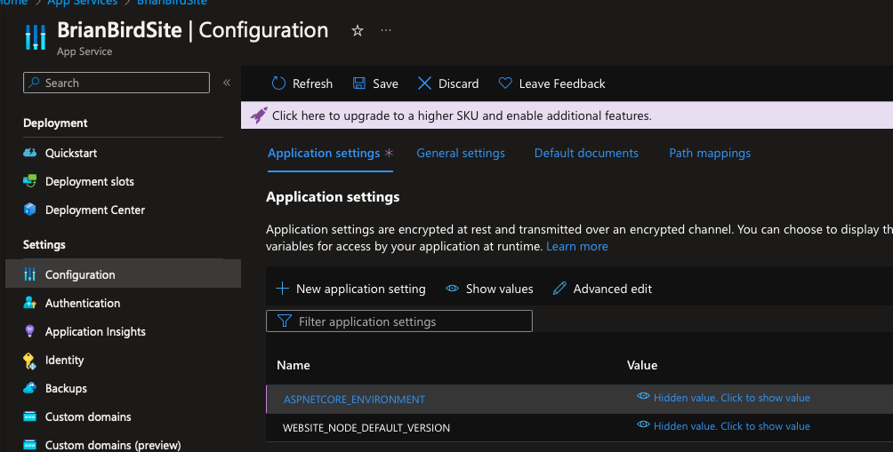

<h1>Azure App Service</h1>
<h2>How to Set ASPNETCORE_ENVIRONMENT</h2>

Setting the ASPNETCORE_ENVIRONMENT variable in an Azure App Service to "Development" enables detailed error information to be shown on a web page when an exception is thrown by your web app. It is recommending that you not do this if for a production web site (visible to real users), since it could be a security risk.

Here are the steps:

1. In Portal.Azure.com, open your Azure App Service and click on "Configuration":  
   

2. On the Configuration screen, click on "+ New application setting" (in the middle): 
   

3. Enter the new setting:  
   

   

4. Click on the "Save" button (at the top):

   

### Warning: Connection String Might Be Wrong Now!

Changing the environment variable from the default, *Production*, to *Development*, can affect your database connection string. In short, if you published your web app from Visual Studio for Windows and put the Azure database conneciton string in the settings dialog, then changing the environment varialbe will break it!

The reason for this is that when you publish your web app from Visual Studio for Windows, it creates a new file, `appsettings_Production.json`[^1], which contains the connection string for your Azure database. That asppsettings file will only be used when the environment variable is set to *Production*. When the environment variable is set to *Development*, the app will look frist for a conneciton string in `appsettings_Development.json`, then in `appsettings.json`.

**TL;DR** Your database connection string will llikely revert to the development machine's connection string when you change the environment variable to *Development*, so <u>don't change it to troubleshoot database problems</u> and if you do change it, <u>change it back when you are done troubleshooting</u>.

[^1]: The appsettings_production.json that is created by Visual Studio for Windows when you publish to Azure is only sent to your Azure App Service, it isn't added to your Visual Studio project.

