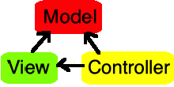
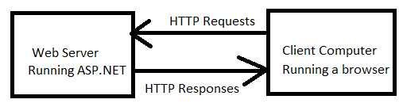

**[CS295N Web Development 1: ASP.NET](http://lcc-cit.github.io/CS295N-CourseMaterials/)**

<h1>Intro to Web Dev</h1>

<h2>Contents</h2>

[TOC]

## Introduction to the course

- Introduce myself
- Take roll, ask about degree programs, favorite web sites, programming experience
- Announcements 

## Intro to Web Development

### Job Prospects for Developers

U.S. News [The 100 Best Jobs](https://money.usnews.com/careers/best-jobs/rankings/the-100-best-jobs) for 2024

- [#3: Software Developer](https://money.usnews.com/careers/best-jobs/software-developer)

  > A software developer is a professional who is responsible for designing and building computer programs. Some may build underlying operating systems, while others may focus only on developing new mobile and desktop applications. They also develop computer games and other digital architecture.&mdash;Indeed.com
  - #1 in Best Technology Jobs
  - Median Salary: $127,260

### Meaning of Different Job Titles

- Software engineer vs. software developer vs. web developer  
  The terms *software engineer* and *software developer* are often used interchangeably, but many professionals see the following distinctions:
  - Engineers are the architects who can design complete software systems.
  - Developers are coders who build what the engineers design (although most engineers are also coders).
  - Web developers are software developers whose expertise is  focused on web development.
- Web Developer vs. Web Designer

  - Developers focus on functionality.
  - Designers focus on appearance.
  - Both are concerned with UX (User eXperience) and fulfilling user's requirements.
- What job can you get with an LCC Computer Programming degree?

  - Any of the above are possible!
  - You might start as a web developer and through self-study and OJT (On the Job Training) advance your skills to qualify for a higher position.

### Distinctives of Web Development

- Differences between desktop and web development

  - Multiple languages and technologies in one app: HTML, CSS, JavaScript, C#, SQL
  
- Multiple browsers types and browser compatibility
  - Multiple concurrent users
  - No direct access to the client file system
  - Statelessness of HTTP
  
- Development tools you will use in this class

  - Visual Studio
  - Visual Studio Code
  - Development server (on your local machine)
  - Web browsers

## Overview of MVC

- MVC
  - Not new, originated in 1978 with the Smalltalk project at Xerox PARC
  - Became popular with Ruby on Rails, 2005
  - Block diagram (arrows show direction of dependencies):
             

    - Model: data
    - View: renders HTTP responses
    - Controller: responds to HTTP request
  
- Facilitates programming best practices

  - Minimize dependencies
  - Separation of concerns

  - Unit tests

- Server-side rendering
  Web pages consisting of HTML, CSS and JavaScript are generated on the server and full web pages are sent to the client's browser.
  
  
  
  - Used for multi-page web sites, not SPA sites.
  - Good for database intensive apps.
  - Entire page needs to be refreshed unless you use AJAX.

## Exercise 

*This is the first part of the lab assignment.*

- Build the default Visual Studio web site.
- Identify the Models, Views, and Controllers.
- Identify dependencies.
- Identify HTML, CSS, and JS resources.

## Class Procedures

- Discuss code reviews
- Discuss weekly cycle of assignments 
- Review due dates

## References

- [Software Engineer vs. Software Developer—What’s the Difference?](https://www.fullstackacademy.com/blog/software-engineer-vs-software-developer)&mdash;Fullstack Academy, 2023.
- [Overview of ASP.NET Core MVC](https://learn.microsoft.com/en-us/aspnet/core/mvc/overview?view=aspnetcore-10.0#mvc-pattern)&mdash;Microsoft, Steve Smith, 2025.

------

ASP.NET Core MVC Lecture Notes by [Brian Bird](https://profbird.dev), 2024, revised in <time>2026</time>, are licensed under a [Creative Commons Attribution 4.0 International License](http://creativecommons.org/licenses/by/4.0/). 

------

