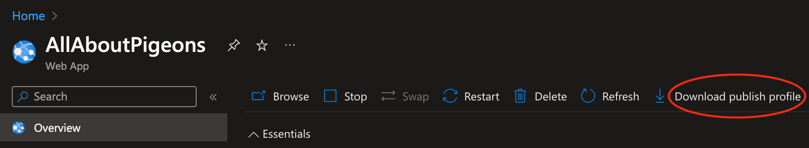
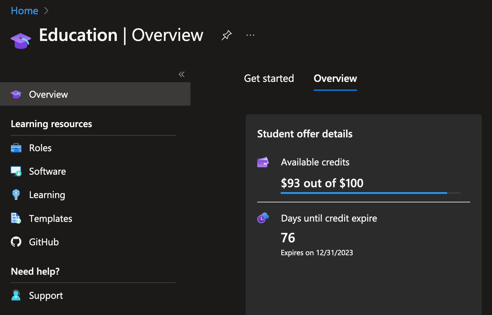

**[CS295N Web Development 1: ASP.NET](http://lcc-cit.github.io/CS295N-CourseMaterials/)**

<h1>Publishing a Web App to Azure</h1>

<h2>Contents</h2>

[TOC]
## Overview

**Microsoft Azure** is a [cloud computing](https://en.wikipedia.org/wiki/Cloud_computing) service created by [Microsoft](https://en.wikipedia.org/wiki/Microsoft) for building, testing, deploying, and managing applications and services through Microsoft-managed [data centers](https://en.wikipedia.org/wiki/Data_center). It provides [software as a service (SaaS)](https://en.wikipedia.org/wiki/Software_as_a_service), [platform as a service (PaaS)](https://en.wikipedia.org/wiki/Platform_as_a_service) and [infrastructure as a service (IaaS)](https://en.wikipedia.org/wiki/Infrastructure_as_a_service) and supports many different [programming languages](https://en.wikipedia.org/wiki/Programming_language), tools and frameworks, including both Microsoft-specific and third-party software and systems. - [Wikipedia](https://en.wikipedia.org/wiki/Microsoft_Azure)

 

## Azure for Students

Microsoft offers a free Azure subscription for students and gives you $100 in credit on to spend on Azure services. The subscription is good for 12 moths or until you use up your credit—whichever comes first. There are many [services that are free](https://azure.microsoft.com/en-us/free/students/) with this subscription. We will not use Azure for anything that requires you to use your Azure credit in this class, so you should be able to use your account for the full 12 months. If you are still a student when the 12 months end, you can renew your free subscription.

### Get a Free *Azure for Students* Account 

1. If you haven't already [signed up for a Microsoft account](https://account.microsoft.com/) using your LCC e-mail address, do it now. 
2. Sign up for [Azure Dev Tools for Teaching](https://signup.azure.com/studentverification?offerType=3) using your LCC e-mail address—if you haven't already done this.
3. On the [Azure Dev Tools for Teaching](https://portal.azure.com/?Microsoft_Azure_Education_correlationId=bbe97574-470e-4568-b0db-4d73ba7adfd2#blade/Microsoft_Azure_Education/EducationMenuBlade/overview) page, click the blue button with the title "Claim your Azure Credit Now"
4. On the following page, [Start building the future with Azure for Students](https://azure.microsoft.com/en-us/free/students/), click the green button with the title "Activate now".

## Deploy a Web App to Azure

### Create an App Service on Azure

- On the [Azure portal](https://portal.azure.com) web page, search for or browse to "App Services" (aka "Web App") and click on "Create", then choose "Web App".
- Select the options shown in the screen-shot below:
  

### Publish Your App from Visual Studio 

- In Visual Studio, run the publish wizard by right-clicking on the project and selecting publish.

- Click on configure to change the settings in your publish profile.

  For detailed instructions, see the tutorial in the [references](#References) section on Publishing a Web app to Azure.

- Now you can publish your web app.

Note that your publish profile won't be tracked in Git. This is for security reasons. You will need to download the publish profile from your Azure portal on each computer you use. The download link is in the App Service.

## Managing Your Free Account

If you aren't careful, you may accidentally use services for which you are charged. The charge will be deducted from your $100 credit. If you use up all of your credit, <u>your account will be terminated</u>. So, it's important to be sure you are only using free services. To see which services are free, refer to the Azure for Students FAQ in the [references](#References) section.

### Free services and pricing plans

All of the services we will use in this class are free and will not reduce your $100 credit. The services and pricing plans you will use are:

- Azure App Service on the "F1:Free" pricing plan
  - You may have up to 10 free app services.

- SQL Server&mdash;no pricing plan required
- SQL Database on the "Standard S0: 10 DTUs" pricing plan
  - You may only have <u>one free database</u>.
  - Note that currently (Fall 2020), a billing rate is shown when you select this pricing plan, but that billing rate does not apply to Azure for Students accounts. the Standard plan is actually free.

### Monitoring your charges

To be sure you aren't being charged, or to see what you are being charged for, you can go to the Azure portal, open the Eduction service, and check to see how much credit and time you have remaining on your free subscription.

## Troubleshooting Your Web App on Azure

If you are having problems with your web app on Azure there are a couple things that will help you with debugging:

1. Enable detailed error pages:
   - Follow these instructions to go to the configure app services page in the Azure portal:[ https://docs.microsoft.com/en-us/azure/app-service/configure-common#configure-app-settings](https://docs.microsoft.com/en-us/azure/app-service/configure-common#configure-app-settings) 
   - Add a new application setting with:
     - Name: ASPNETCORE_ENVIRONMENT
     - Value: Development

2. Enable logging and look at log files:

   https://stackify.com/azure-app-service-log-files/

   

## References

- [Azure for Students FAQ](https://azure.microsoft.com/en-us/free/free-account-students-faq/)&mdash;Microsoft

- [Microsoft Azure Sponsorships](https://www.microsoftazuresponsorships.com/)&mdash;Check your Azure credit billing

- [Publish a Web App to Azure App Service using Visual Studio](https://learn.microsoft.com/en-us/visualstudio/deployment/quickstart-deploy-aspnet-web-app?view=visualstudio)&mdash;Microsoft Visual Studio Docs

  

------

 ASP.NET Core MVC Lecture Notes by [Brian Bird](https://profbird.dev), 2020, revised <time>2026</time>, are licensed under a [Creative Commons Attribution-ShareAlike 4.0 International License](http://creativecommons.org/licenses/by-sa/4.0/). 

------

