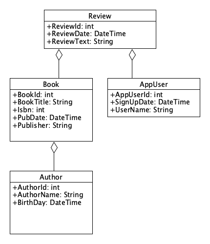

**CS295N Web Development 1: ASP.NET
**

<h1>Entity Framework</h1>

| Weekly Topics                           |                                             |
| --------------------------------------- | ------------------------------------------- |
| 1. Intro to Web Dev                     | 6. Unit Testing                             |
| 2. Intro to MVC & Deploying to Azure    | 7. <mark>Database & Entity Framework</mark> |
| 3. Working with Data                    | 8. Unit Testing & The Repository Pattern    |
| 4. Bootstrap                            | 9. Linq & Seed Data                         |
| 5. Midterm Quiz & Term Project Proposal | 10. Debugging                               |

<h2>Contents</h2>

[TOC]

# Announcements and Discussion

For fall term 2023

- Lab 5, any questions on the quiz code or unit tests?
  - Beta version due Tuesday (tomorrow), production version Thursday

- Quiz closes at class time Wednesday.

# Introduction

This week we will learn how to add a database to our web app. We will use a SQL database, but we won't be writing code to interact directly with the database, we'll use *Entity Framework* (EF) to simplify our database code.

We'll put the new code that does database operations in our controller methods.This will be a bit problematic for unit testing, so next week we'll refactor our database code to use something called the *Repository Pattern* which will facilitate unit tests for controller methods that access a database.

## Object Relational Mapping and EF Core 

One of the main functions of Entity Framework is to do [Object Relational Mapping](https://en.wikipedia.org/wiki/Object-relational_mapping). The purpose of an Object Relational Mapper (ORM) is to serve as a bridge between the world of our object oriented code and the world of the relational database. An ORM maps a domain model to a database schema and allows developers to just focus on writing OO code while the ORM takes care of database operations.

EF is not the only ORM option for .NET Core developers. Other options include:

- [NHibernate](https://github.com/nhibernate/nhibernate-core) -- the most mature and popular alternative to EF for .NET developers
- [Dapper](https://github.com/StackExchange/Dapper)
- [NPoco](https://github.com/schotime/NPoco/wiki)
- [LINQ to Db](https://linq2db.github.io)


Entity Framework Core has [database providers](https://docs.microsoft.com/en-us/ef/core/providers/) that support the following database types:

- SQL Server (including LocalDB)
- Microsoft Access
- Oracle
- SQLite
- PostgreSQL
- MySQL and MariaDb
- Db2
- And more


# Adding Entity Framework to a Web App

There are two major approaches to software development with EF:
- Code first (Model first) -- we are using this approach

- Database first 

In order to use Entity Framework in your web app, you need to modify your code in the ways shown below.

## NuGet Packages

Use the NuGet Package Manager in Visual Studio to add the following packages to your project:
Note: select a pacakge version that matches your .NET version.

- Microsoft.EntityFrameworkCore
- Microsoft.EntityFrameworkCore.Design
- A database provider for the type of database you will use:
  - Microsoft.EntityFrameworkCore.SqlServer (for LocalDB on Windows)
  - Microsoft.EntityFrameworkCore.Sqlite (for SQLite on MacOS)
  - Pomelo.EntityFrameworkCore.MySql (for MySQL on any OS)


## Models


Ideally, we would like our models to be designed solely with object oriented design in mind&mdash;without thinking about databases. But in reality we do need to consider how Entity Framework will generate a database schema based on our models. There are two main things to consider:

- Defining primary keys:

  We need to identify a field in the model that EF can map to a primary key. 

  We have two alternatives:

  - Add the [&lsqb;key&rsqb;](https://docs.microsoft.com/en-us/dotnet/api/system.componentmodel.dataannotations.keyattribute?view=netcore-2.1) data annotation attribute to a property to make a *natural key*:

    Ask yourself, would this provide a unique key?

    ````c#
    public class Book
    {
      [key]
      public string Title { get; set; }
      // Additional properties not shown
    }
    ````

  - Add an ID property to make a *synthetic key*:
    By convention, any property name ending in ID will be mapped to a primary key
    This is guaranteed to be a unique key

    ```c#
    public class Book
    {
      public int BookId { get; set; }
      public string Title { get; set; }
      // Additional properties not shown
    }
    ```

- Many-to-many relationships are supported in .NET 5.0 and later, but you often don't need that complexity.  
TODO: Provide an example of a search that might look like it requires a many-to-many relationship, but doesn't.

## DbContext Class

This class provides your web app with an entry point to access Entity Framework Core which provides access to the database. 

- You need to define your own database context class that inherits from DbContext

  ```C#
  public class ApplicationDbContext : DbContext
  {
    // constructor just calls the base class constructor
    public ApplicationDbContext(
       DbContextOptions<ApplicationDbContext> options) : base(options) { }
    
    // one DbSet for each domain model class
    public DbSet<Book> Books { get; set; }
    public DbSet<Review> Reviews { get; set; }
    public DbSet<AppUser> AppUsers { get; set; }
  }
  ```

- This class is often put in a folder named `Data` which will alter hold other database related classes.

## Connection String in appsettings.json 

- A connection string specifies the location and name of the database and provides configuration settings.  
  Note: it is best practice to not store login credentials in your Git repository.

- You will eventually have four versions:

  - `appsettings.json` &mdash; containing general settings (no login credentials).

  - `appsettings.Development.json` &mdash; containing settings specific to your development machine, such as the connection string for your local database (possibly containing login credentials).

  - `appsettings.Staging.json` &mdash; containing settings specific to your web server, but for testing.

  - `appsettings.Production.json` &mdash; containing settings specific to your web server.

- Example of three different connection strings stored in appsettings.Development.json. 

  ```json
  "ConnectionStrings": {
   "SQLServerConnection":"Server=(localdb)\\MSSQLLocalDB;Database=BookReviews; Trusted_Connection=True;MultipleActiveResultSets=true",
   "SQLiteConnection":"DataSource=Data/BookReviews.db", 
   "MySqlConnection":"server=localhost;userid=birdb;password=Secret!123;database=BookReviews;"
  }
  ```


## Program.cs


This serves as the `main` for the application and is not a class. This is the first code to run when the application starts.

- [AddDbContext](https://docs.microsoft.com/en-us/dotnet/api/microsoft.extensions.dependencyinjection.entityframeworkservicecollectionextensions.adddbcontext?view=efcore-2.1) will read the connection string and configure your DbContext object to connect to your database. 

- This where you will later add more calls to `builder.services` methods to set up *dependency injection* to inject your DbContext object into any of your classes (like your controller classes) that the framework instantiates and where you have your DbContext class as a parameter in the constructor.

- The options argument specifies that this is a Microsoft SQL Server database, but you could also use another database, like SQLite.

- Example:

  ```C#
  var connectionString = builder.Configuration.GetConnectionString("MySqlConnection");
  builder.Services.AddDbContext<ApplicationDbContext>(options =>
      options.UseMySql(connectionString, ServerVersion.AutoDetect(connectionString)));
  ```

## Controller Code for Storing and Retrieving Data

In Controller methods where you want to store or retrieve data you will use an instance (object) of your DbContext class (ApplicationDbContext in our example), to do database operations. In order to use the DbContext object in a controller it needs to be passed in via the controller's constructor, like this:

```C#
public class ReviewController : Controller
    {
        ApplicationDbContext context;
        public ReviewController(ApplicationDbContext c)
        {
            context = c;
        }
        // The rest of the class is not shown
```

In a controller method that needs to store data, you would call the `Add`, and `SaveChanges` methods on the DbContext object like this:

```C#
 context.Reviews.Add(model);
            context.SaveChanges(); 
```


In a controller method that needs to retrieve a particular item from the database you could call the `Find` method:

```C#
 review = context.Reviews.Find(reviewId);
```


In order to retrieve multiple items, you would just convert the DbSet to a C# List:

```C#
List<Review> reviews = context.Reviews.ToList();
```

The code above will work, but the only properties that are directly on the `Review` objects. The properties on object that are a part of `Review` will not be included.

## Loading related data

Related data is data that comes from objects that are related to the object you are retrieving by aggregation or composition. 

For example, in the <u>hypothetical</u> `Review` domain model below, the `Book`, `Reviewer`, and `Author` properties are related data because they are related to Review objects by aggregation (a Review "has-a" Book and an AppUser, a Book "has-an" Author).



### Ways to load related data

- **Eager loading**
  Related data is loaded from the database as part of the initial query.

  - Use the *Include* method to include dependent objects. You only need this when you include your own model classes (not for *DateTime* or other classes that are not part of your domain model.)
  
  - Use *ThenInclude* for second-level dependencies.
    
    Example code snippet from a controller method that gets a list of `Review` objects from a database:
    
    ```C#
    public List Reviews = context.Reviews
      .Include(review => review.Reviewer) // returns Reivew.AppUser object
      .Include(review => review.Book) // returns Review.Book object
      .ThenInclude(book => book.Author)  // returns Review.Book.Author object
      .ToList();
    ```
    
  
    The syntax of the include statement is:  
    
    *Include(parameterRepresentingDbSet => parameter.ModelPropertyName)*
  
- **Explicit loading**
  Related data is explicitly loaded from the database at a later time.
  (See the article below for more details.)
  
- **Lazy loading**
  Related data is transparently loaded from the database when a dependent property (or navigation property) is accessed.
  (See the article below for more details.)

> **Reference**
> MS EF Core Tutorial: [Loading Related Data](https://docs.microsoft.com/en-us/ef/core/querying/related-data)

------


# Creating a Database

Before you can run your app, you need to create a database on the host system. This might be your development machine, or a production server. On your development machine. But, before you can create a database, you need to add a database migration. You can read about that in the Migrations section below. 

## dotnet CLI Tools

In order to do operations on our database, we will be using CLI (Command Line Interface) commands. (Not the commands for the Package Manager Console) You can check to see if you have the CLI tools for Entity Framework installed by entering the command:
 `dotnet ef`

You should get this response:

```bash
                     _/\__
               ---==/    \\
         ___  ___   |.    \|\
        | __|| __|  |  )   \\\
        | _| | _|   \_/ |  //|\\
        |___||_|       /   \\\/\\

Entity Framework Core .NET Command-line Tools 3.1.2
Usage: dotnet ef [options] [command]
Options:
  --version        Show version information
  -h|--help        Show help information
  -v|--verbose     Show verbose output.
  --no-color       Don't colorize output.
  --prefix-output  Prefix output with level.
Commands:
  database    Commands to manage the database.
  dbcontext   Commands to manage DbContext types.
  migrations  Commands to manage migrations.
Use "dotnet ef [command] --help" for more information about a command.
```

If you get a message like this:
"*Could not execute because the specified command or file was not found*", it is probably because the CLI tools for EF haven't been installed. You can install them by executing this command:

`dotnet ef tool install --global dotnet-ef --version 3.1.x`

**Note:** Replace `x` with the patch level that matches the version of EF Core you are using, for example: 3.1.30.

Note that this will install the tools globally, if you only want to install them for the current project, then leave off the --global switch. And, if you are using a version of ASP.NET Core other than 3.1 (which we are using this term in class), then change the version number. If you omit the --version switch, it will install the latest version.

You can also update the tools using this command:

`dotnet tool update dotnet-ef --global --version 3.1.x`

Again, `x` is a placeholder for an actual number.

## Migrations

*Migrations* are a means of solving the problem of how to update the database when the models change. After changing any model, you will need to "add a migration" which puts code in the Migrations folder of the project that will be used by EF to update the Db schema as well as migrate the data from the old schema to the new schema.

### Creating a Migration

Use the CLI command: 
`dotnet ef migrations add Initial`

- No database will be created
- A file will be added to the Migrations folder
- The DbContextModelSnapshot file will be created or updated

Running this command will cause the following to take place:

1. Build the .NET Core assembly for the project in the folder where you ran the command
2. Find DbContext classes
3. Find IDesignTimeDbContextFactory implementations
4. Find application database service provider
5. Find BuildWebHost method
6. Use environment 'Development'.
7. Use application service provider from BuildWebHost method on 'Program'
8. Connect to LocalDB using the user's Windows credentials
   *---------* *the first 8 operations are the same for adding a migration and appling a migration ---------*
9. Create new migration file in the Migrations folder
10. Update the sanpshot file in the Migrations folder 

### Applying a Migration and creating (or updating) the database 

Use the CLI command:
 `dotnet ef database update`

- If the database hasn't previously been created, this command will also create the database.
- Running this command will cause the same operations as the first eight above to take place, plus: 

  - Create a database if one does not exist 

  - Execute SQL statements to apply the migrations if they are not already applied

- Reference: [EF Core .NET Command-line Tools](https://docs.microsoft.com/en-us/ef/core/miscellaneous/cli/dotnet)

Note: if you want to drop the database so you can run update again, use this CLI command:

`dotnet ef database drop`

### Managing Development and Production Databases

- Remove the ConnectionStrings object from the appsettings.json file.

- Add two new appsettings files
  Your web app will automatically choose the appsettings file with the right connection string based on whether the app is running in a production or development environment.

  - appsettings.Development.json 
    Containing the connection string for your local database. For example: 

    ```json
    }"ConnectionStrings": {
        "MySqlConnection": "server=localhost;userid=birdb;password=Secret!123;database=BookReviews;",
        "SqliteConnection": "Data Source=Data/BookReviews.db"
      }
    ```

  - appsettings.Production.json 
    Containing the connection string for the database on your web server. For example: 

    ```json
    
    {
      "ConnectionStrings": {
        "MySqlConnection": "Server=bookreviews.mysql.database.azure.com;UserID=userName;Password=Not1Telling!;Database=BookReviews;"
      }
    
    ```

- Updating the database (which means applying migrations)

  - The CLI command for using the production version is: 
    `dotnet ef database update -- --environment Production`

    For more options when updating a database, see: [dotnet ef database update](https://learn.microsoft.com/en-us/ef/core/cli/dotnet#dotnet-ef-database-update)

  - When publishing to a web server (or Azure) from Visual Studio for Windows, you will choose the production connection string in the publish dialog.

## Viewing Your Database


After EF has created a database, you can use *SQL Server Object Explorer* in Visual Studio to view it.

- The server name will be: *(localdb)\MSSQLLocalDB*
- Connection should be through Windows Authentication with a user name that looks like: *DESKTOP-SGC2610\Brian*

*Main things of interest:* 

- Tables
- Columns
- Data 


# Running Unit Tests 


Adding EF should not have broken any of your Quiz unit tests, but it will have broken your unit tests for controller methods that work with data&mdash;comment those tests out for now. But it's still good practice to run the tests on the quiz before pushing your code to GitHub. 


# Example


[BookInfo, branch EF](https://github.com/LCC-CIT/CS295N-Bookinfo-Core-21/tree/EF)


------

# References

## Print Books

- Ch. 4, "How to develop a data-driven MVC web app", 

  *Murach’s ASP.NET Core MVC*, 1st Edition, by Mary Delamater and Joel Murach, Murach Books, 2020.

- Ch. 8 "Sports Store, a Real Application", section titled, "Preparing a Database",

  *Pro ASP.NET Core MVC 2*, Adam Freeman, Apress, 2017.

## Online

- Microsoft Docs: [Entity Framework Core](https://docs.microsoft.com/en-us/ef/core/)
- Microsoft Tutorial: [Get started with ASP.NET Core MVC and Entity Framework Core using Visual Studio](https://docs.microsoft.com/en-us/aspnet/core/data/ef-mvc/)
- .NET Core API Reference: [System.ComponentModel.DataAnnotations Namespace](https://docs.microsoft.com/en-us/dotnet/api/system.componentmodel.dataannotations?view=netcore-3.1)
- Microsoft Reference: [Entity Framework Core tools reference - .NET CLI](https://docs.microsoft.com/en-us/ef/core/miscellaneous/cli/dotnet)
- Microsoft Reference:[SQL Server Express LocalDB](https://docs.microsoft.com/en-us/sql/database-engine/configure-windows/sql-server-express-localdb)
  SQL Server Express LocalDB is automatically installed with Visual Studio. This article explains what it is, how it works, how to use it, troubleshooting, and how to install it independently from Visual Studio.


------

[](http://creativecommons.org/licenses/by/4.0/) These ASP.NET Core MVC Lecture Notes written by [Brian Bird](https://profbird.dev) in 2018 and revised in 2023,  are licensed under a [Creative Commons Attribution 4.0 International License](http://creativecommons.org/licenses/by/4.0/). 

