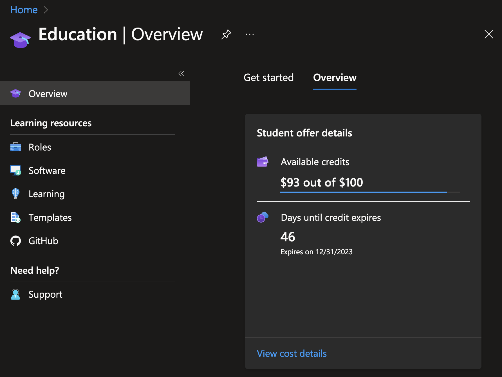

CS295N Web Development 1: ASP.NET 

<h1>Repositories and Unit Testing</h1>

| Weekly Topics                           |                                                       |
| --------------------------------------- | ----------------------------------------------------- |
| 1. Intro to Web Dev                     | 6. Unit Testing                                       |
| 2. Intro to MVC & Deploying to Azure    | 7. Database & Entity Framework                        |
| 3. Working with Data                    | <mark>8. Unit Testing & The Repository Pattern</mark> |
| 4. Bootstrap                            | 9. Linq & Seed Data                                   |
| 5. Midterm Quiz & Term Project Proposal | 10. Debugging                                         |

<h2>Contents</h2>

[TOC]               

# Q and A

**For 11/15/2023**

- Upcoming due dates:
  - Lab 6 is due tonight, publishing to Azure is not required.
  - This is the last week to change grade options.
  
- Check your Azure for Students credit balance!  
  It's on the Education resource  
  


- Any questions?


# Publishing to Azure

See the [references](#References) below for instructions on how to publish a web app with either a SQL Server database or a MySQL database.

Pay close attention to which services are [free with the Azure for Students subscription](https://azure.microsoft.com/en-us/free/students/). Don't create a database that isn't free; it will eat up your credits and you will loose your subscription!  You can have <u>only one</u> of each database type. Here are the database services that are free:

| Service                  | Description                                                | Service details                                              | Pricing tier / Configuration                         |
| ------------------------ | ---------------------------------------------------------- | ------------------------------------------------------------ | ---------------------------------------------------- |
| Azure Database for MySQL | Host a fully managed, scalable MySQL database in Azure     | 750 hours of Flexible Server—Burstable B1MS Instance, 32 GB storage, and 32 GB backup storage | Burstable, B1ms, 1 vCores, 2 GiB RAM, 32 GiB storage |
| SQL Database             | Create a SQL database that delivers intelligence built-in. | 100,000 vCore seconds of SQL database serverless usage per month with 32 GB of storage | Standard S0: 10 DTUs                                 |


# Unit Testing with a Fake Repository

## What to test

Before writing any unit tests, you need to know what methods to test. We want to test any computation or processing done by our app. We primarily test controller methods and sometimes helper methods on models (if there are any). There may also be some additional classes we've added that have functionality that should be tested (like a quiz or game).

## Example, in the Test Project

### A fake repository class

Note that the `List` object is used in place of a database.

```C#
public class FakeReviewRepository : IReviewRepository
{
    private List<Review> reviews = new List<Review>();   // Use a list as a data store

    public Review GetReviewById(int id)
    {
        Review review = reviews.Find(r => r.ReviewId == id);
        return review;
    }

    public int StoreReview(Review model)
    {
        int status = 0;
        if (model != null)
        {
            model.ReviewId = reviews.Count + 1;
            reviews.Add(model);
            status = 1;    
        }
        return status;
    }
}
```

### Unit tests using the fake repository

```c#
public class ReviewControllerTests
{
    IReviewRepository repo = new FakeReviewRepository();
    ReviewController controller;

    public ReviewControllerTests()
    {
        controller = new ReviewController(repo);
    }

    [Fact]
    public void Review_PostTest_Success()
    {
        // arrange
        // Done in the constructor

        // act
        var result = controller.Review(new Review());

        // assert
        // Check to see if I got a RedirectToActionResult
        Assert.True(result.GetType() == typeof(RedirectToActionResult));
    }

    [Fact]
    public void Review_PostTest_Failure()
    {
        // arrange
        // Done in the constructor

        // act
        var result = controller.Review(null);

        // assert
        // Check to see if I got a RedirectToActionResult
        Assert.True(result.GetType() == typeof(ViewResult));
    }

}
```


# Unit of Work

Why some people use the Unit of Work pattern:

> The goal of the unit of work pattern is to simplify DML (Data Manipulation Language) in your code and only commit changes to the database/objects when it's truly time to commit. &mdash;https://github.com/Coding-With-The-Force/Salesforce-Separation-Of-Concerns-And-The-Apex-Common-Library/wiki/05)-The-Unit-of-Work-Pattern


# References

- *Murach’s ASP.NET Core MVC*, 2nd Edition, by Mary Delamater and Joel Murach, Murach Books, 2022.
  - In Ch. 14, How to use dependency injection and unit testing: "How to test methods that have dependencies", pg. 580–583.
  - In Ch. 17, How to deploy ASP.NET Core MVC Apps: "How to publish a data-driven app to Azure", pg. 716&ndash;721.
- [Setup Azure Database for MySQL Flexible Server](https://lcc-cit.github.io/CS295N-CourseMaterials/Notes/AzureMySqlSetupGuide.html), Brian Bird, 2022.
- [Publish an ASP.NET Core app to Azure with Visual Studio](https://learn.microsoft.com/en-us/aspnet/core/tutorials/publish-to-azure-webapp-using-vs?view=aspnetcore-8.0&viewFallbackFrom=aspnetcore-6.0#deploy-the-app-to-azure), Microsoft, 2023.
- [Publishing a Web App to Azure](https://lcc-cit.github.io/CS295N-CourseMaterials/LectureNotes/CS295N-LN-WK02D1-PublishingToAzure.html#monitoring-your-charges), Brian Bird, 2023.  
  Describes the free Azure for Students subscription and how to publish a web app <u>without a database</u> to a free Azure App Service. (Notes from week 2 of this course.)

------

[](http://creativecommons.org/licenses/by/4.0/) ASP.NET Core MVC Lecture Notes by [Brian Bird](https://profbird.dev), written 2018, updated 2023, is licensed under a [Creative Commons Attribution 4.0 International License](http://creativecommons.org/licenses/by/4.0/). 

------

