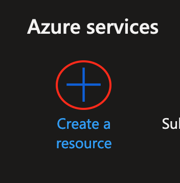
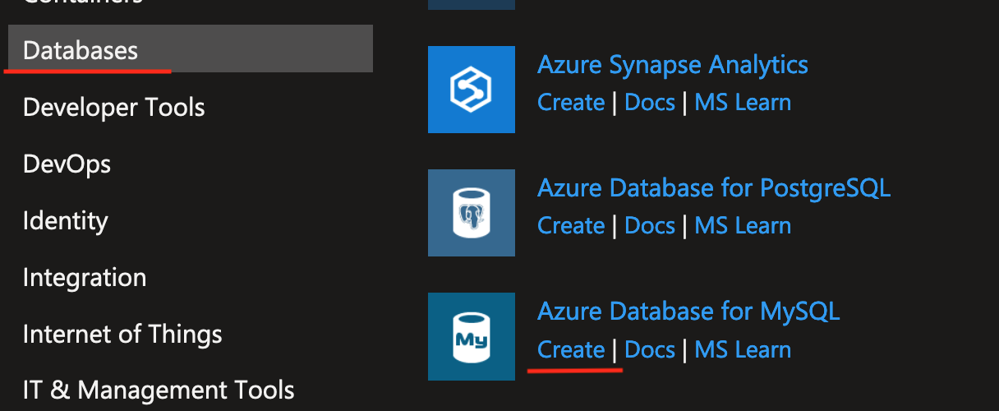
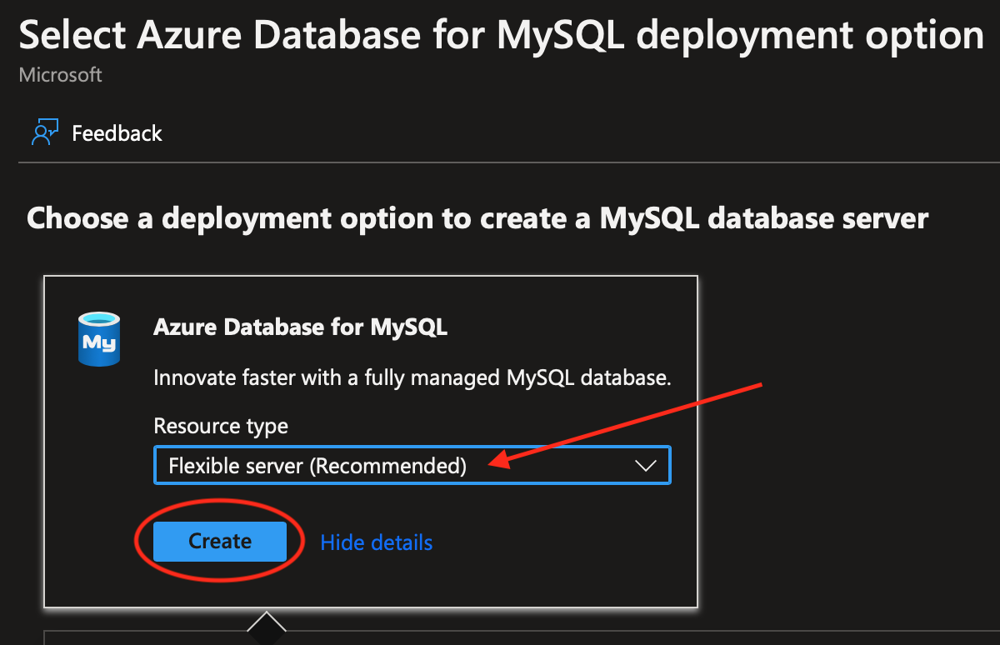
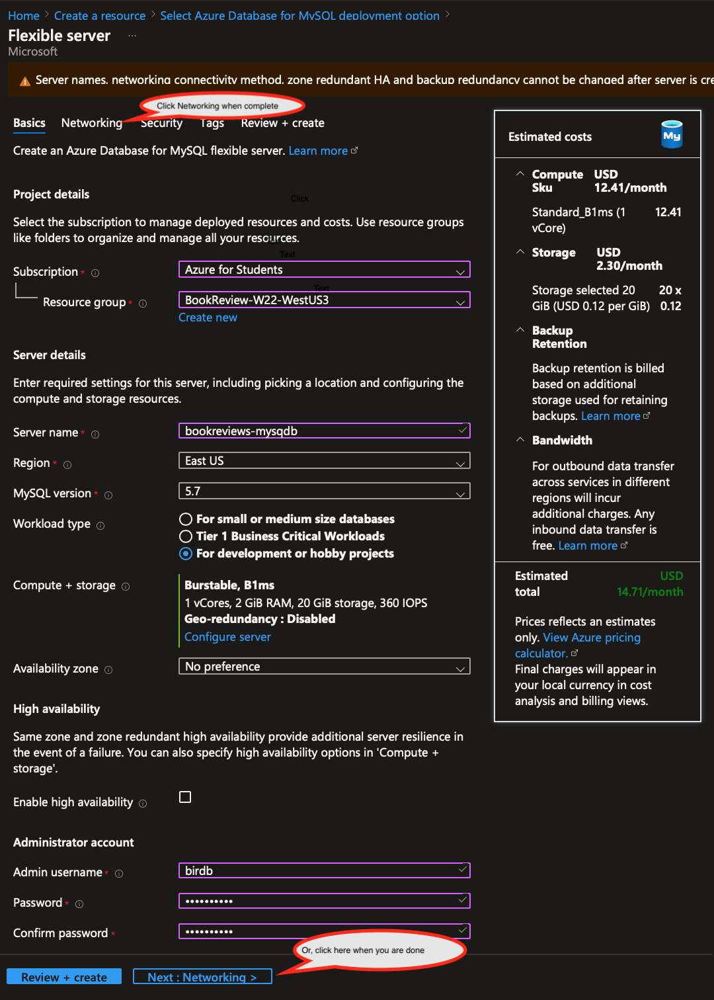
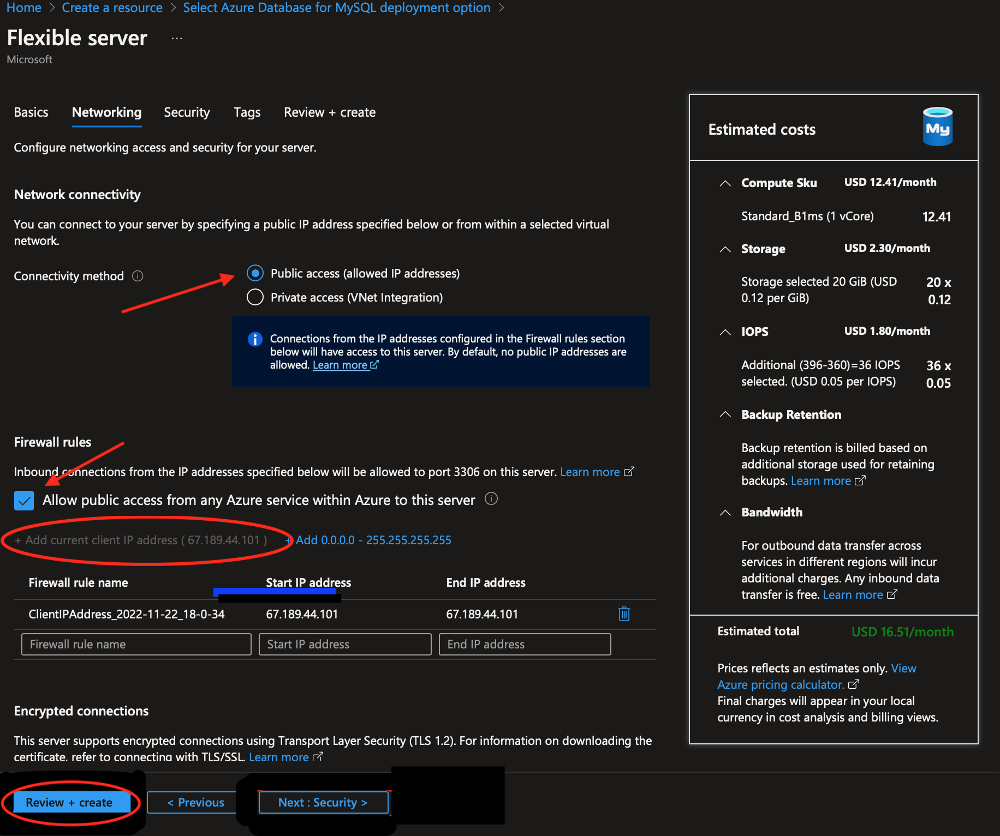
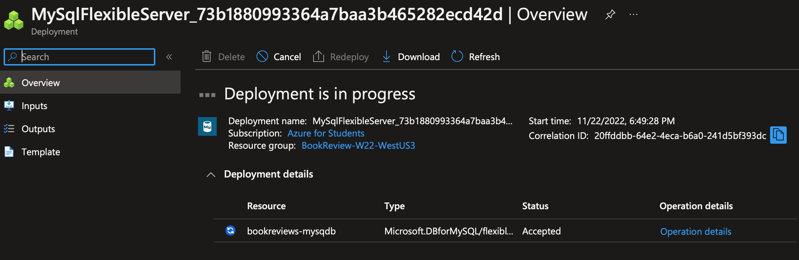
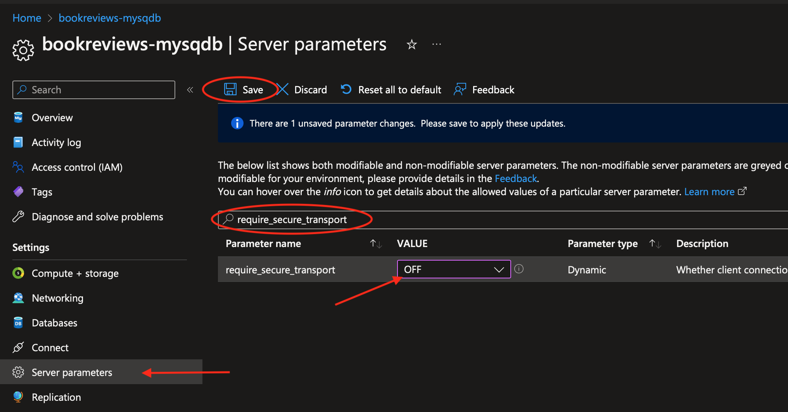
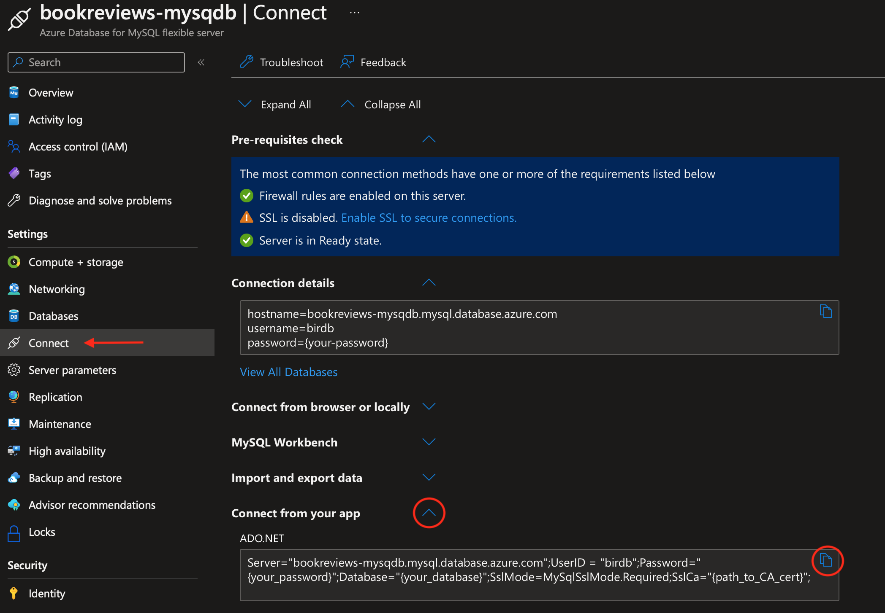
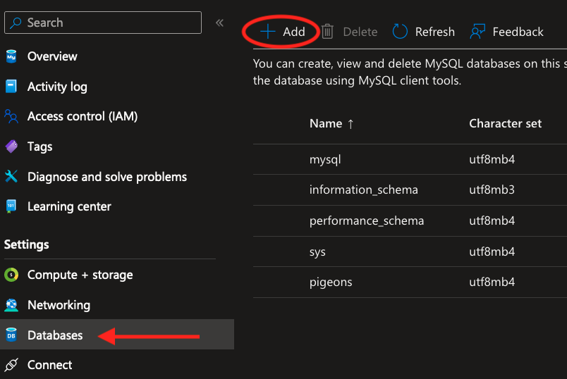
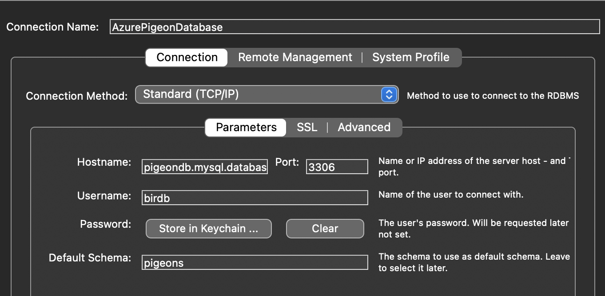

<h1>Setup for Azure Database for MySQL Flexible Server</h1>

<h2>Setup Guide</h2>

[TOC]

Note: The Azure Portal when accessed via Firefox for Mac does not seem to work for all the steps in this guide. Safari was used successfully on a Mac (November 2022).

# Setup Through the Azure Portal

## Create an Azure Database for MySQL

Open the [Azure portal](https;//portal.azure.com), on the main screen, **click *Create a Resource***.



Click on ***Databases*** in the left-side menu, then under *Azure Database for MySQL*, click on ***Create***. 




***Select Flexible Server (Reccommended)***, then click on ***Create***.




## Configure the MySQL Database Server

On the next screen, fill in all the values as shown in the image below. For some of the fields you will need to make choices or entries that are specific to your database, such as:

- **Resource group**: Use one of your existing resource groups or make a new one. The choice is not critical. Resource groups are like *namespaces*, they are just for organizing your resources.
- **Server name**: Just pick a name that is descriptive and helpful to you.
- **Region**: Try a few that are somewhat close to our location until you find one that supports the *Azure for Students* plan.
- **Workload type**: Be sure to select For ***development or hobby projects*** so you can get a free server.
- **Computer + Storage**: The default is the free option. You don't need to click on *Configure Server*.
- **Admin Username**: Enter one you can remember or write it down. This does <u>not</u> to be the same as any other username you have on Azure or on your local MySql database.
- **Password / Confirm Password**: Be sure to write your password down, you can't retrieve it later.

Now click on the *Networking* tab, or ***Next: Networking***

*Note: Even though a cost is shown, your Azure for Students credit won't be charged.*



On the networking screen:

- Select ***Public access (allowed IP addresses)***

- Check the checkbox to Allow ***Public access from any Azure service***

- Select ***+ Add current client IP address***

You're done, click on ***Next: Security***




That's it for the settings.  
Click ***Review + Create***, then if everything looks ok, click ***Create***!

You will see the deployment screen. The deployment might take a few minutes.



Once deployment is complete, go to the new resource and prepare to disable secure connections (SSL). 

Note:  We're disabling secure connection to the database just to simplify our setup. If you want to have a secure connection, you can read: [Connect to Azure Database for MySQL - flexible server with Encrypted Connections](https://learn.microsoft.com/en-us/azure/mysql/flexible-server/how-to-connect-tls-ssl#disable-ssl-enforcement-on-your-flexible-server).

On the resource page for your new Azure Database for MySql flexible server, in the left side menu, click on ***Server parameters***, then put ***require_secure_transpor***t in the search box, then once that parameter has been found, set it's value to ***OFF***, to finish, click ***Save***.




Finally we need to get a connection string that we can use with Entity Framework. Click on Overview in the left hand menu, click on ***Connect***, then expand the ***Connect from your app*** list, and copy the ***ADO.NET*** connection string..




Once the ADO.NET connection string has been copied, you will need to modify it for use when publishing your ASP.NET MVC web app to Azure. Whether you are putting it into an Appsettings.json file (to publish from VS for Mac), or into the Publish settings dialog (to publish from VS for Windows), you need to:

- Remove all the quotes.
- Add you password. 
- Add the database name (not necessarily the Azure database resource name).
- Remove the SslMode and SslCa key-value pairs.

For example:

```json
Server=bookreviews-mysqdb.mysql.database.azure.com;UserID=birdb;Password=Secret!123;
Database=bookreviews;
```

Now your database server is ready for use!

##Adding a Database

You can add a database to the server in a number of ways:

- Use MySQL workbench to add a schema to the server.
- On your development machine, run the dotnet CLI command: `dotnet ef database update`, using the connection string for your server on Azure (see below),  which will apply the current migration and create the database on the server on Azure.
- Use the Azure Database for MySQL page on the Azure Portal to create a database.




# Connecting to the Database

## From a Web App

Example connection string for the Entity Framwork Pomelo MySql database provider:

```json
"Server=pigeondb.mysql.database.azure.com:3306;User=birdb;Password=Secret!123;database=pigeons;"
```

**Note:** When using the *Publish* feture in Visual Studio, this connection string is causing errors when I add it to *Addional Settings, Database* and try to use it to apply migrations when publishing.


## Updating a Database with EF CLI Tools

You can use the `dotnet ef update` command to update a remote database like the one you created on Azure.

### Specify the Environment in the Command

By specifying an environment, `Development` or `Production`, you can control which `appsettings.json` file and by that, which connection string is used for the `update` command. Here is an example:
```
dotnet ef database update -- --environment production
```
Note that there are two sets of dashes, `-- --` , this is not a typo!

### Specify a Connection String in the Command

Use this command to update the database and apply a migration:


```bash
dotnet ef database update --connection 'Server=pigeondb.mysql.database.azure.com;Port=3306;User=birdb;Password=Secret!123;database=pigeons;'
```

Note that when using zsh in the terminal on a Mac, you must use single quotes around the connection string. With Bash on Windows you can use either double or single quotes.

## With Workbench for MySQL

Create a connection using these parameters:




# References

- [Use an Azure free account to try Azure Database for MySQL - Flexible Server for free](https://learn.microsoft.com/en-us/azure/mysql/flexible-server/how-to-deploy-on-azure-free-account#connect-and-query)  
  Note that this tutorial is for subscribers to the free 12 month Azure trial which requires a credit card for billing purposes. I do *<u>not</u>* recommend using this free trial since you can get unexpected charges on your credit card. But the procedure for setting up a free MySQL database is nearly identical for Azure for Students subscribers.
  
- [Quickstart: Use the Azure portal to create an Azure Database for MySQL flexible server](https://learn.microsoft.com/en-us/azure/mysql/flexible-server/quickstart-create-server-portal)

- [Connect to Azure Database for MySQL - Flexible Server with encrypted connections](https://learn.microsoft.com/en-us/azure/mysql/flexible-server/how-to-connect-tls-ssl#disable-ssl-enforcement-on-your-flexible-server)

- https://learn.microsoft.com/en-us/ef/core/cli/dotnet

- [Connection String Options for Pomelo MySQL Database Provider](https://mysqlconnector.net/connection-options/)  
  This documentation is for MySqlConnector which is used by the Pomelo DB provider.
  
  

[](http://creativecommons.org/licenses/by/4.0/) These ASP.NET Core MVC Lecture Notes written by [Brian Bird](https://profbird.dev) in 2022 and revised in <time>2024</time>,  are licensed under a [Creative Commons Attribution 4.0 International License](http://creativecommons.org/licenses/by/4.0/). 

