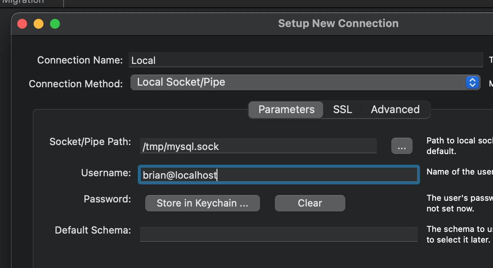

<h1>MariaDB Installation and Setup</h1>

MariaDB documentation: https://mariadb.org

[TOC]

## Server Installation

### For Windows and Linux

#### Download

https://mariadb.org/download

### For Mac OS

####Download and Install

Install MariaDb using Homebrew

https://mariadb.com/kb/en/installing-mariadb-on-macos-using-homebrew/

From the output of the Homebrew install:

> A "/etc/my.cnf" from another install may interfere with a Homebrew-built server starting up correctly.
>
> MySQL is configured to only allow connections from localhost by default
>
> To restart mariadb after an upgrade:
>
>  brew services restart mariadb
>
> Or, if you don't want/need a background service you can just run:
>
>  /usr/local/opt/mariadb/bin/mysqld_safe --datadir=/usr/local/var/mysql 
>
> **Summary**
>
> 🍺 /usr/local/Cellar/mariadb/10.6.4: 903 files, 183MB

### Getting Started

After MariaDB Server is started, you can log in as your user:

```
mysql
```

Or log in as root:

```bash
sudo mysql -u root
```


[MariaDB Primer](https://mariadb.com/kb/en/a-mariadb-primer/)

This primer is designed to teach you the basics of getting information into and out of an existing MariaDB database using the [mysql](https://mariadb.com/kb/en/mysql-command-line-client/) command-line client program.


-----

## Graphical Management Utility Installation

### MySQL Workbench for Windows, Linux and Mac OS

This is Oracle's GUI tool for MySQL. The community edition is free but requires an Oracle account (free).

https://www.mysql.com/products/workbench/

This is the setting for the default connection:


